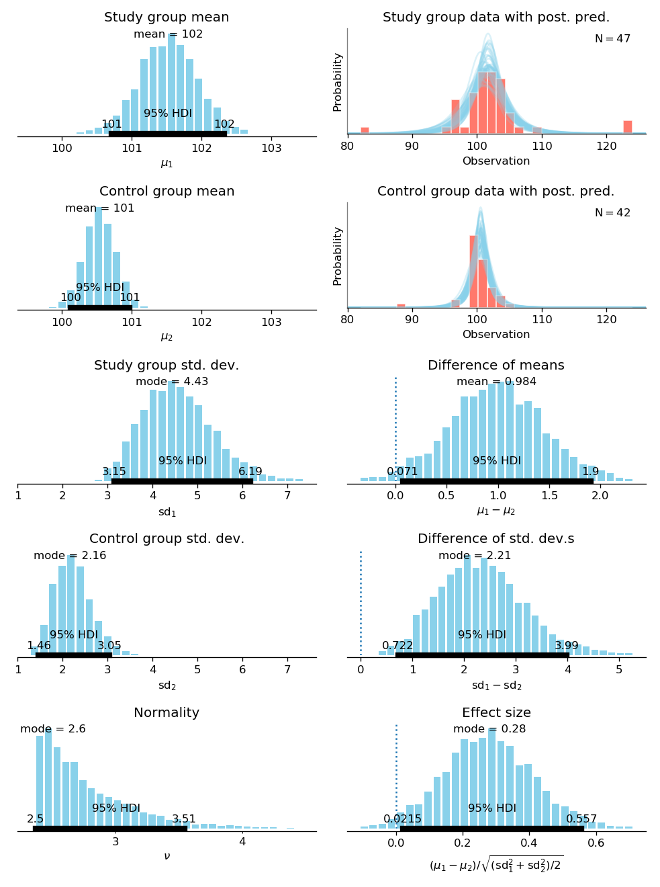

# BEST: Bayesian Estimation Supersedes the t-Test

Python implementation of a Bayesian model to replace t-tests with Bayesian estimation,
following the idea described in the following publication:

> John K. Kruschke. _Bayesian estimation supersedes the t test._
> Journal of Experimental Psychology: General, 2013, v.142 (2), pp. 573-603. (doi: 10.1037/a0029146) 

The package implements Bayesian estimation of the mean of one or two groups,
and plotting functions for the posterior distributions of variables such as the effect size,
group means and their difference.

## Documentation ##

See the documentation for more information, at [best.readthedocs.io](https://best.readthedocs.io).

## Requirements ##

 - Python ≧ 3.5.4
 - SciPy
 - [Matplotlib](http://matplotlib.org) (≧ 3.0.0) for plotting
 - [PyMC3](https://github.com/pymc-devs/pymc)

## Examples ##

A complete analysis and plotting is done in just a few lines:

```python
>>> best_out = best.analyze_two(group1_data, group2_data)
>>> fig = best.plot_all(best_out)
>>> fig.savefig('best_plots.pdf')
``` 
For example, the two-group analysis in `examples/smart_drug.py` produces the following output:



More detailed analysis of the same data can be found in the Jupyter notebook `examples/Smart drug (comparison of two groups).ipynb`.

An example single-group analysis can be found in `examples/paired_samples.py`.

The [documentation](https://best.readthedocs.io) describes the API in detail.

## Installation ##

Ensure your Python version is sufficiently up-to-date:

```bash
$ python --version
Python 3.5.6
```

Then install with Pip:
```bash
$ pip install https://github.com/treszkai/best/archive/master.tar.gz
```

## Developer notes ##

### Tests ###

Running the tests requires [pytest](https://docs.pytest.org/en/latest/index.html): 

```bash
$ pytest tests
```

The plotting tests only ensure that the `plot_all` function does not throw errors,
and the plots need manual verification at `tests/data/plot_all_*.pdf`.

### Documentation ###

The documentation can be built with Sphinx:

```bash
$ cd docs
$ make html
```
