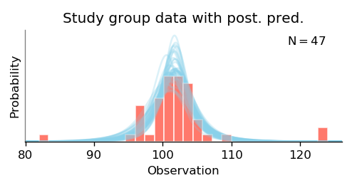
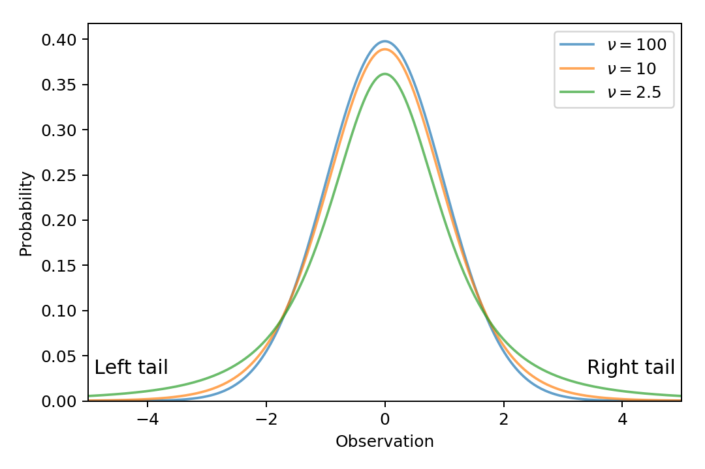

Explanations of the Outputs
===========================

.. module:: best
   :noindex:

.. _brief-description:

Brief description of the procedure
----------------------------------

BEST models the data as samples from a `t-distribution <wiki/Student%27s_t-distribution>`_,
which is a distribution much like the `Gaussian (normal) distribution <https://en.wikipedia.org/wiki/Normal_distribution>`_,
with an :ref:`additional parameter <sec-normality>` that controls the prevalence of outliers.
After assigning a prior distribution to the parameters,
these distributions are updated in accordance with how well each parameter setting fits the data,
resulting in the so-called *posterior distribution*.
(The specifics of the prior are explained on the :ref:`Model history <sec-model-latest>` page.)

The resulting t-distributions can be plotted with the :func:`plot_data_and_prediction` function,
whose output is a figure like this:

.. _sec-variables:

Variables
---------

A :class:`BestResults` object contains posterior samples of every variable of the model --
meaning .
Most of the variables are plotted by :func:`plot_all`,
but any variable can be plotted separately with :func:`plot_posterior`.
The posterior samples of a given variable (e.g., ``Mean``) can be extracted from a :class:`BestResults` object (called ``best_out``) as ``best_out.trace['Mean']``.

The result of a one-group analysis (i.e., a :class:`BestResultsOne` object) has samples of the following variables:

 - ``Mean``: mean of the t-distribution that models the data. Denoted as μ.
 - ``Sigma``: scale parameter of the t-distribution that models the data. Denoted as σ.
 - ``Normality``: "normality" parameter of the t-distribution. For details, see :ref:`below <sec-normality>`. Denoted as ν.
 - ``SD``: standard deviation of the t-distribution. Equal to :math:`\sigma \sqrt{\nu / (\nu - 2)}`. Often denoted as “sd”.
 - ``Effect size``: the difference between the mean and the given reference value, relative to the standard deviation. For each credible combination of means and standard deviations, the effect size is calculated as :math:`(\mu - \mathrm{ref\_val}) / \mathrm{sd}`.

Some undocumented variables, such as ``Log sigma``,
are used only as a means to an end (in this case, to calculate ``Sigma``).

The result of a two-group analysis (i.e., a :class:`BestResultsTwo` object) has samples of the following variables:

 - ``Group 1 mean``: mean of the t-distribution that models group 1. Denoted as :math:`\mu_1`.
 - ``Group 1 sigma``: :math:`\sigma` parameter of the t-distribution that models group 1. Denoted as :math:`\sigma_1`.
 - ``Group 1 SD``: standard deviation of the model of group 1. Denoted as :math:`\mathrm{sd}_1`.
 - ``Group 2 mean``: mean of the t-distribution that models group 2. Denoted as :math:`\mu_2`.
 - ``Group 2 sigma``: :math:`\sigma` parameter of the t-distribution that models group 2. Denoted as :math:`\sigma_2`.
 - ``Group 2 SD``: standard deviation of the model of group 2. Denoted as :math:`\mathrm{sd}_2`.
 - ``Normality``: “normality” parameter of the t-distributions of both groups. For details, see :ref:`below <sec-normality>`. Denoted as :math:`\nu`.
 - ``Difference of means``: the difference of the means of the two groups. Calculated as :math:`\mu_1 - \mu_2`.
 - ``Difference of SDs``: the difference of the standard deviations of the two groups. Calculated as :math:`\mathrm{sd}_1 - \mathrm{sd}_2`.
 - ``Effect size``: difference of the means, relative to the average standard deviation of the groups. For each credible combination of means and standard deviations, the effect size is calculated as :math:`(\mu_1 - \mu_2) \,\big/\, \sqrt{(\mathrm{sd}_1^2 + \mathrm{sd}_2^2) \,/\, 2}`.

.. _sec-normality:

Normality
---------
The normality parameter of `Student's t-distribution <http://mathworld.wolfram.com/Studentst-Distribution.html>`_ (denoted by the `Greek letter nu <https://en.wikipedia.org/wiki/Nu_(letter)>`_, :math:`\nu`) controls the likelihood of strong outliers:
the larger this parameter, the more centered the distribution, meaning data points far from the mean are less likely.
We refer to this parameter as “normality” – instead of the conventional “degrees of freedom” [#dof]_ –
because a :math:`t_\nu(\mu, \sigma)` distribution approximates a :math:`\mathrm{Normal}(\mu, \sigma)` distribution increasingly better as :math:`\nu` increases.
The below figure plots t-distributions with different normality parameters, with the important difference in the tails of the distributions:

The *Normality* plot produced by :func:`plot_all` shows credible values of the
normality parameter in the t-distribution.
The values are shown on a logarithmic scale, because the shape of the t-distribution changes
noticeably for values of :math:`\nu` near 3 but changes relatively little for :math:`\nu > 30`.
If the Normality histogram shows that most of the likely values of :math:`\nu` are relatively low (below ~10),
then the credible t-distributions are heavy-tailed to accommodate outliers in the data;
if :math:`\nu` is large (above ~30), the distributions of the groups are nearly normal.

.. _sec-mean-mode:

Plots: mean vs. mode
--------------------
The current implementation shows the *mean* of the posterior samples for distributions that are usually symmetric (such as the mean of a group),
and the *mode* used for distributions that are usually skewed (such as the standard deviation),
in accordance with the original publication (Kruschke, 2013). This behavior may change in the future.

In any case, it is advised to note the :abbr:`HPD (highest posterior density)` interval together with the mean or the mode.

.. rubric:: Footnotes

.. [#dof] Whereas the “degrees of freedom” name arises from `how the t-distribution is commonly used <https://en.wikipedia.org/wiki/Student%27s_t-distribution#How_the_t-distribution_arises>`_, which is not intrinsic to the distribution.