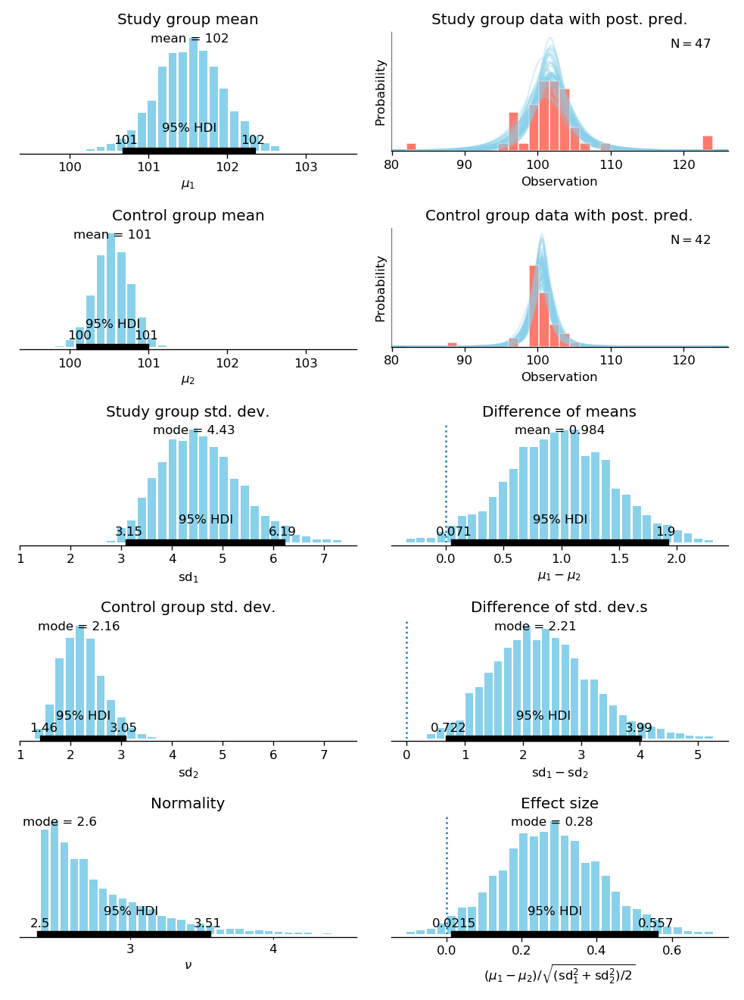

BEST: Bayesian Estimation Supersedes the t-test
========================================================

*Bayesian parameter estimation, made simple.*

BEST is a tool to replace t-tests with Bayesian estimation,
and it can create beautiful plots and simple summaries in just a few lines of Python code::

    >>> group1_data = [101, 100, 102, 104, 102,  # ...
    ...                101, 101, 104, 100, 101]
    >>> group2_data = [102, 100,  97, 101, 104,  # ...
    ...                100, 101, 100, 102, 99, 100, 99]
    >>> best_out = best.analyze_two(group1_data, group2_data)
    >>> fig = best.plot_all(best_out)
    >>> fig.savefig('best_plots.pdf')

BEST gives intuitive results without being a statistician.
For example, to find the probability that the first group's mean is larger by at least 0.5 than the other's::

   >>> best_out.posterior_prob('Difference of means', low=0.5)
   0.87425

The parameter estimation is described briefly in :ref:`the relevant section <brief-description>`,
or in detail in the following publication:

   John K. Kruschke, 2013. Bayesian estimation supersedes the *t* test.
   Journal of Experimental Psychology: General, 2013, v.142(2), pp.573-603.
   (doi: `10.1037/a0029146 <https://dx.doi.org/10.1037/a0029146>`_)

The publication's `accompanying website <http://www.indiana.edu/~kruschke/BEST/>`_
points to more resources on the topic.

Purpose
-------

BEST is intended as a replacement for a t-test,
to help transition to a world where science embraces uncertainty,
while keeping the tools simple.

It is *not* intended as a comprehensive data analysis tool.
For that purpose, please refer to books like John K. Kruschke's
`Doing Bayesian Data Analysis <https://sites.google.com/site/doingbayesiandataanalysis/>`_.

Installation
------------

The ``best`` package requires Python 3.5.4 or higher,
and can be installed with *pip*:

.. code-block:: bash

   pip install https://github.com/treszkai/best/archive/master.zip

This command installs the following dependencies:

 - `SciPy <https://scipy.org/>`_,
 - `Matplotlib <http://matplotlib.org>`_ (≧ 3.0.0),
 - `PyMC3 <https://github.com/pymc-devs/pymc>`_.

Get in touch
------------

If you have trouble installing or using `best`, or understanding the results, or you found an error,
please `open an issue <https://github.com/treszkai/best/issues>`_  at the project's GitHub page,
or open a `pull request <https://github.com/treszkai/best/pulls>`_ if you have a proposed solution.

Further documentation
---------------------

.. toctree::
   :maxdepth: 2

   api
   explanations
   model_history
